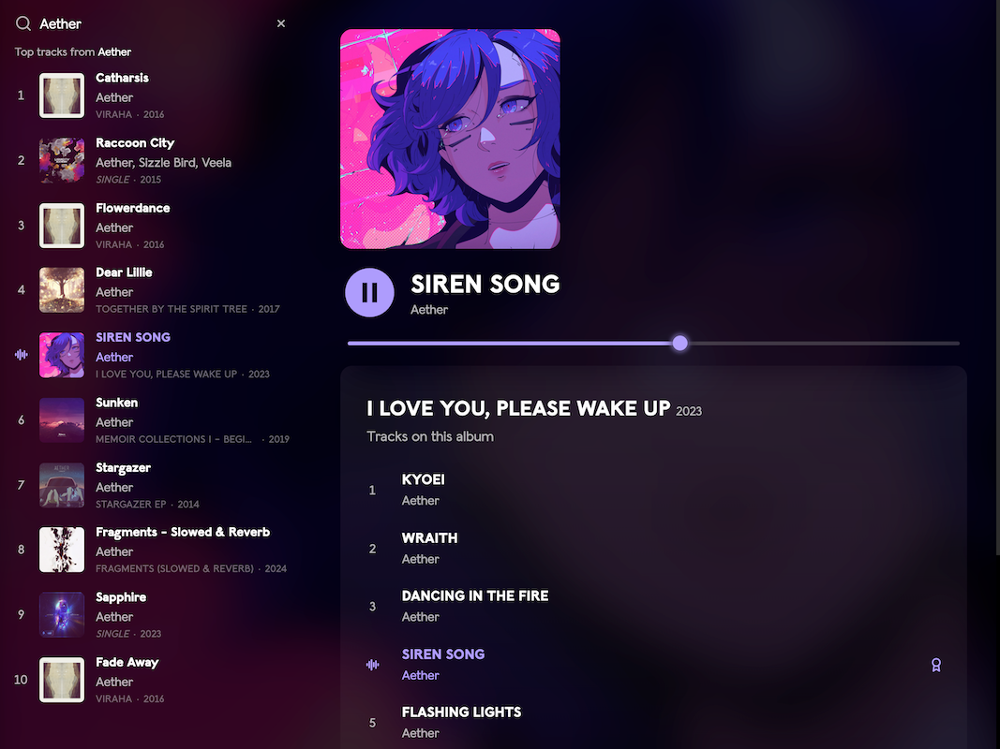
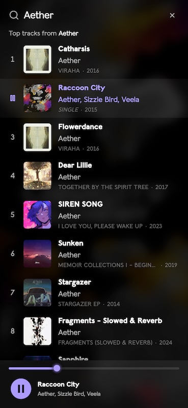

# DripWave

<p><a href="https://dripwave.vercel.app/" target="_blank"></a></p>

A web app to search for artists and preview their music.

<p>
    <a href="https://dripwave.vercel.app/" target="_blank"></a>
    <span></span>
    <a href="https://dripwave.vercel.app/" target="_blank"></a>
</p>

Preview at: 💧 [dripwave.vercel.app](https://dripwave.vercel.app/)

Early state chart: 📊 [Early DripWave planning @ stately.ai](https://stately.ai/registry/editor/71914a7e-b08d-4032-809f-e9e0acb1892e?mode=Design&machineId=1efcb27a-d19b-42b2-a2ad-b464c6903b08)

## Run this project locally

1. Install the dependencies:

```shell
npm install
```

2. In the project, rename `env.example` to `.env`.

3. [Create a new Spotify app via the dashboard](https://developer.spotify.com/dashboard/create)<br/>- "App name" and "App description" can be anything<br/>- For "Redirect URI" you can enter `http://localhost:5173/`<br/>- For "Which API/SDKs are you planning to use?", choose `Web API`.

> Note: When trying to add the app, if you see the error: "You need to verify your email address before you can create an app." then [head to the dashboard](https://developer.spotify.com/dashboard) and you’ll see a prompt to start the verification process.

3. Open your new Spotify app, hit "Settings" then "View client secret".

4. Add your "Client ID" and "Client Secret" to the `.env` file.

5. Then choose one of these tasks:

Start the development server:

```shell
npm run dev
```

Or build and preview the project:

```shell
npm run build
npm run preview
```

## Supported browsers

Tested in:

- Chrome (122)
- Firefox (123.0.1)
- Safari (17)
- Edge (119)

Also tested in mobile Chrome and Safari.

## Supported features

- [x] Play/Pause support (no forward/backward).
- [x] Track seeking support.
- [x] Track playing indicator shown.
- [x] Playback during new search (no interruption).
- [x] Mobile: Tap a track to _play_ the preview.
- [x] Desktop: Click a track to _open_ the track detail.
- [x] Desktop: Double click a track to _play_ the preview.

## Improvements

- [ ] Validate env variables
- [ ] Performance improvements
- [ ] Keep selected track after refresh (desktop view)
- [ ] Add track forward/backward support
- [ ] Avoid fetching artist detail column on mobile

## Technologies

- [Vite](https://vitejs.dev/) - Frontend tooling
- [React](https://reactjs.org/) - Framework
- [Million.js](https://million.dev/) - Faster React compiler
- [Wouter](https://github.com/molefrog/wouter) - Tiny router for React
- [TailwindCSS](https://tailwindcss.com/) - Styling framework
- [TanStack Query](https://tanstack.com/query/v5/) - Data fetching and caching
- [Spotify Web API SDK - TypeScript](https://github.com/spotify/spotify-web-api-ts-sdk) - Data fetching
- [React H5 Audio Player](https://github.com/lhz516/react-h5-audio-player) - Cross browser / a11y supported HTML5 audio player
